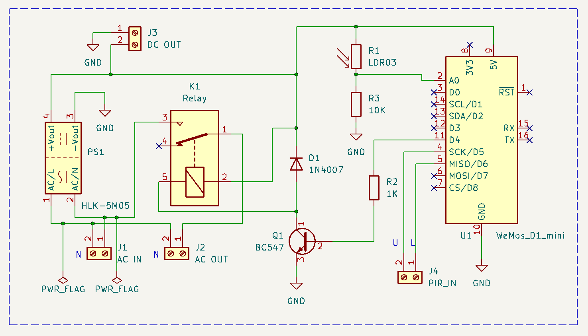
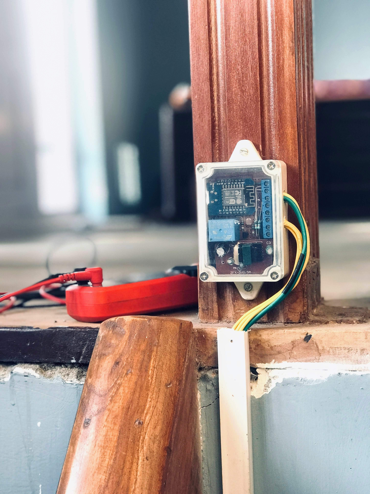
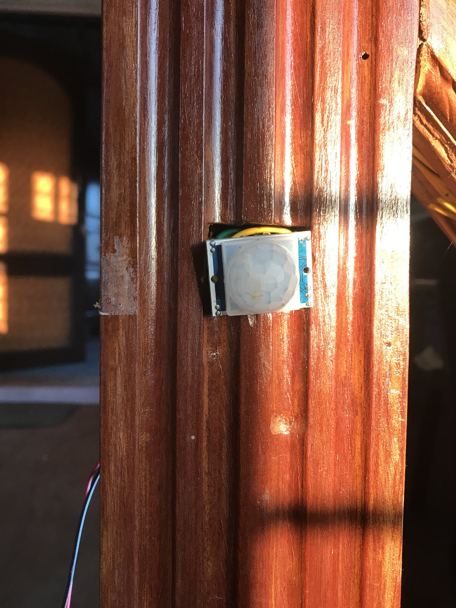
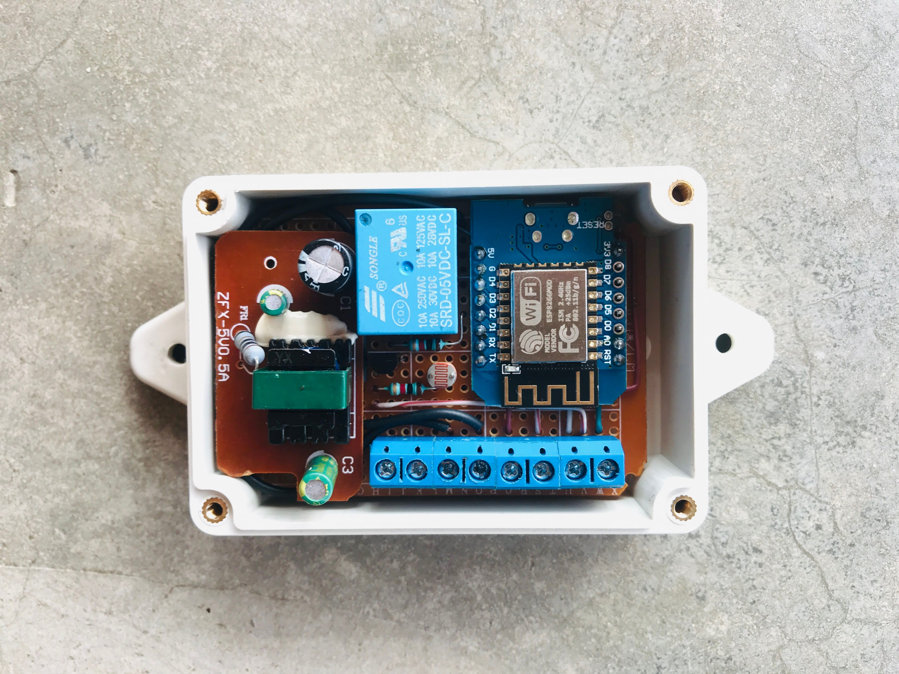
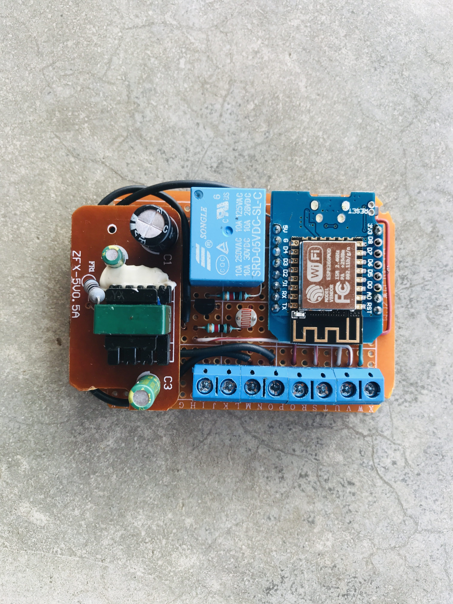
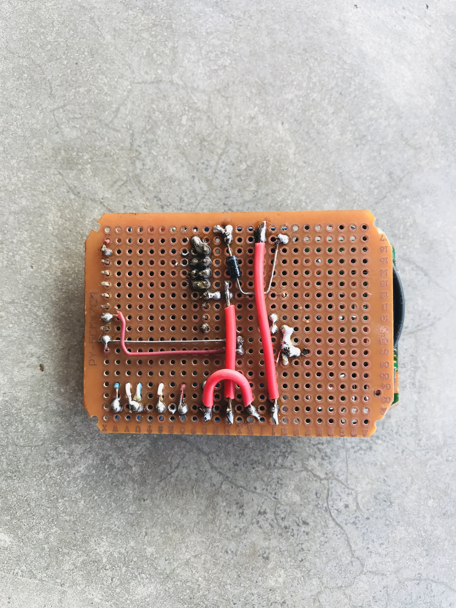

# stairlight_controller

This GitHub repository houses the code and documentation for a Two-Way Passive Infrared (PIR) Stairlight Controller. The controller incorporates PIR sensors to detect motion in both ascending and descending directions, ensuring that the stairlights illuminate when needed and conserve energy when not in use.

## Schematic

The schematic for the device connection is shown below.

## Setting it up.

**Translating Schematic to PCB and Integrating Components:**
Following the meticulous design of the schematic, the next phase involves transposing this plan onto a printed circuit board (PCB). For rapid prototyping and flexibility, a prefboard serves as an excellent choice to bring the schematic to life. This stage allows for a physical manifestation of the electronic layout, facilitating quick adjustments and component placements as needed. Upon transferring the design, selecting an appropriate housing for the circuit becomes pivotal. The chosen housing not only provides protection but also accommodates the PCB and its components snugly. Additionally, this phase involves the crucial step of integrating Passive Infrared (PIR) sensors into the controller setup. These sensors, once connected, enable the controller to detect motion effectively and trigger the desired response in the staircase lighting system. Assembling the components within the selected housing, ensuring meticulous connections between the PCB, PIR sensors, and the controller, ensures a cohesive and functional unit.

---

---

## PIR Sensors

The PIR sensors are connected to the controller's input pins. These sensors are mounted on the poles of the stairs beforehand and are used to detect motion in both ascending and descending directions.

## Addressing False Triggers:

During the integration phase, an important realization surfaced regarding the initial setup. Due to the absence of pull-down resistors, certain values were floating, leading to sporadic false triggers within the system. To rectify this issue and ensure stable operation, 10k resistors were strategically added. These resistors served as pull-down components, stabilizing the values and preventing erratic triggering, thus enhancing the reliability and accuracy of the staircase light controller's functionality.

## More Images of the setup.

## Code

The code for the controller is available on GitHub.
[\stairlight_controller_code](https://github.com/alphaseneca/stairlight_controller/tree/master/stairlight_controller_code)
